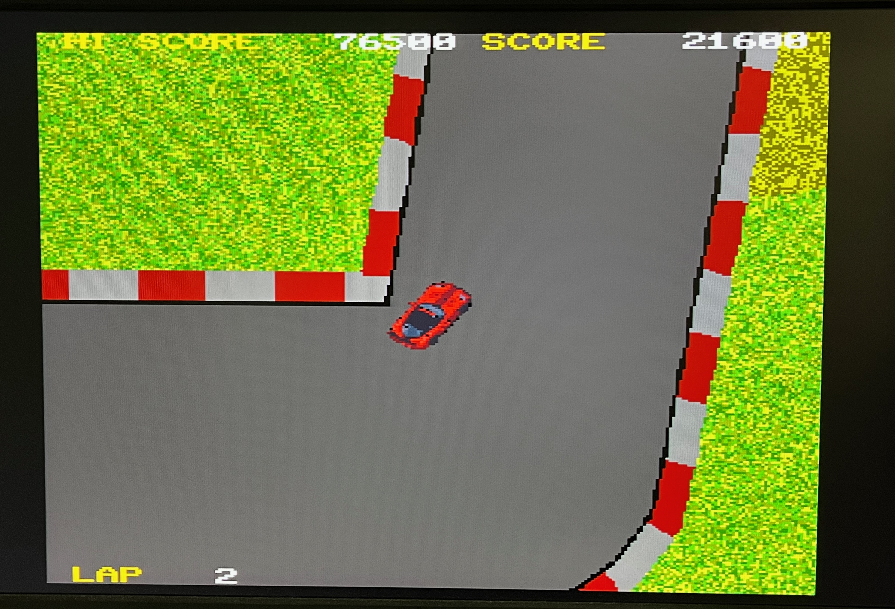
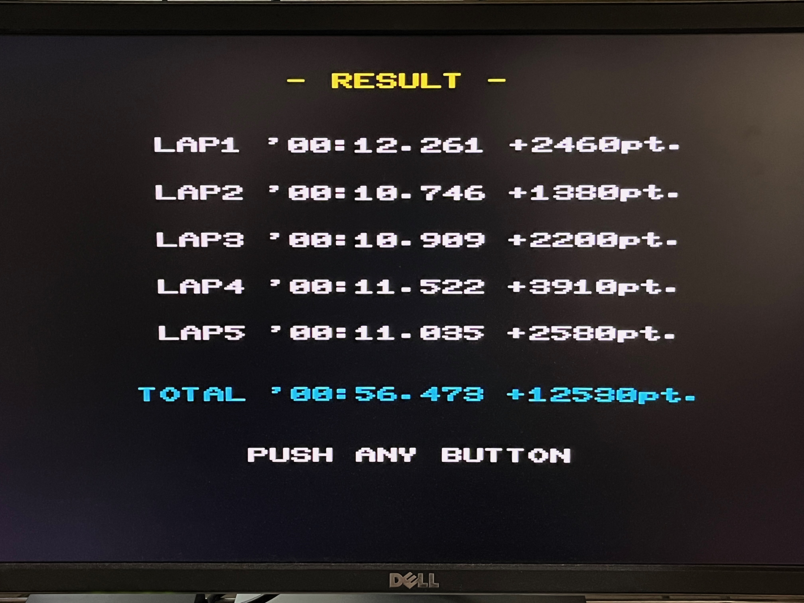

# Pocket Circuit PRO-68K

A tiny circuit drift racing game for X680x0

---

## About This

真上視点のドリフトラジコン風のカーゲームです。サイバースティックに対応しています。

 

---

## 動作環境

* X68000/X68030実機
* サイバースティック または ジョイスティック(ポート1に接続のこと)

サイバースティックを使用する場合は、事前に標準ドライバの AJOY.X を常駐させてください。
X68000 LIBRARY などからダウンロード可能です。
- http://retropc.net/x68000/software/hardware/analog/ajoy/

060turboでAJOY.Xを使う場合は、HUYE氏のパッチを当ててください。
- http://park7.wakwak.com/~huye/x68000_joy.html

---

## 遊び方

ZIPアーカイブファイルを展開し、`POCKETCT.X`, `COURSE1.DAT`, `COURSE1.GRP` がカレントディレクトリにあることを確認します。

サイバースティックを利用する場合は `AJOY.X` を常駐させます。

ゲームを起動し、コースデータのロードが終わると加速待ちの状態からスタートします。最初にスタートラインを切ったところからカウントが始まります。

基本的にタイムアタックをするゲームではなく、いかにドリフトを深いアングルかつロングストロークで、コースからはみ出さないようにして決め、ポイントを稼ぐのが目的です。

5ラップするとゴールでリザルトが表示されます。

ADPCM/FM音源とも使っておらず無音なので、お好きなドライブ・レースゲームのMDXなどを事前に鳴らしておいてからスタートするのがおすすめです。

---

## 開発環境

 - efl2x68k (Thanks to Yunkさん)
 - XEiJ (Thanks to M.Kamadaさん)

---

## 変更履歴

* 0.2.0 (2026/05/25) ... 初版